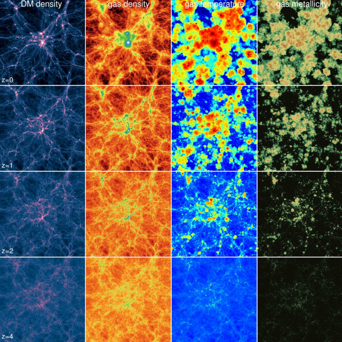
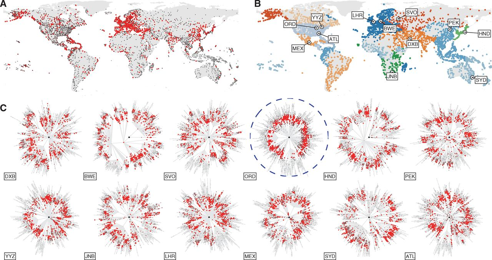
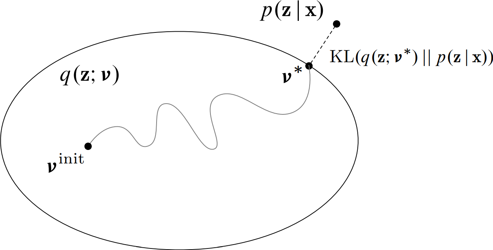
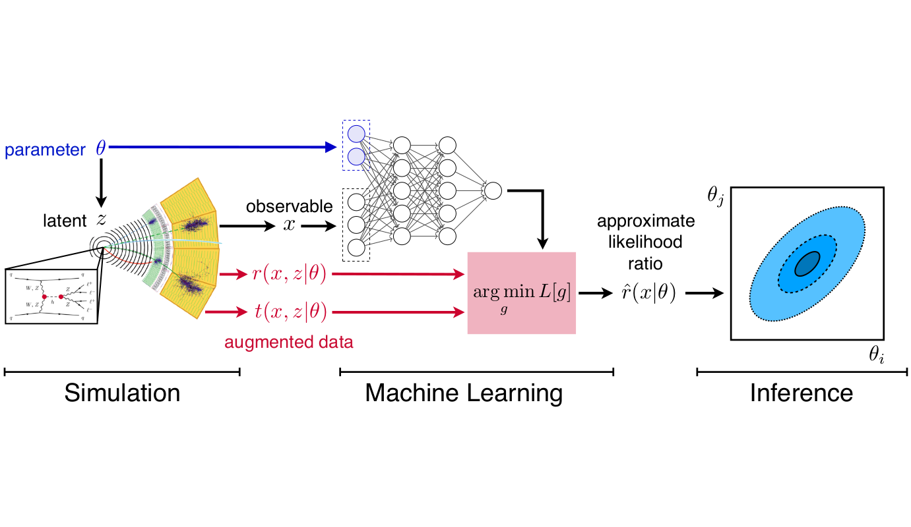
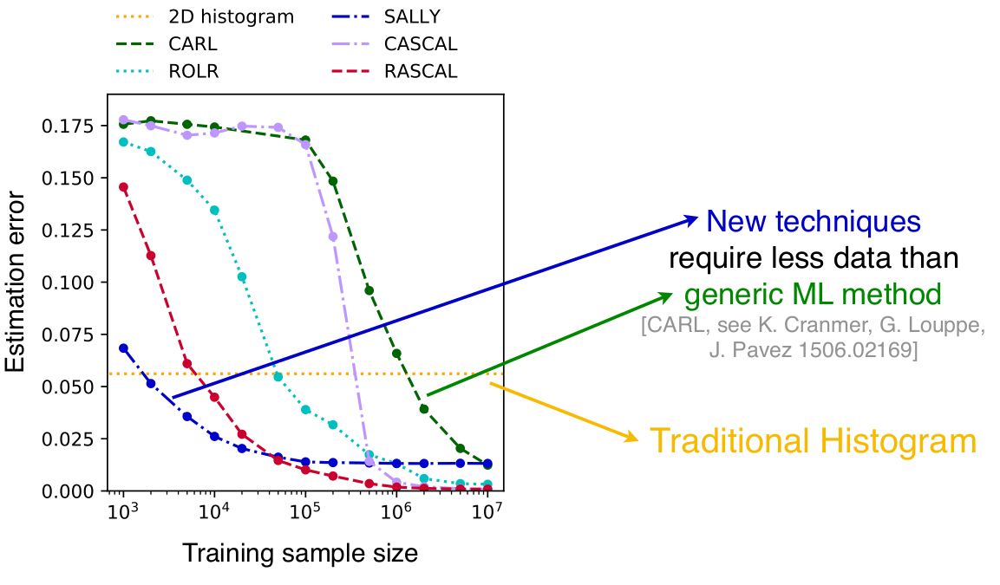

class: middle, center, title-slide
count: false

# Likelihood-free inference in Physical Sciences

Artificial Intelligence and Physicss

Institut Pascal 
March 22, 2019

  

Gilles Louppe 
[@glouppe](https://twitter.com/glouppe)

---

class: middle, black-slide

.center[<video controls autoplay loop muted preload="auto" height="480" width="640">
  <source src="./figures/galton.mp4" type="video/mp4">
</video>]

---

class: middle

.center.width-70[]

The probability of ending in bin $x$ corresponds to the total probability of all the paths $z$ from start to $x$.

$$\begin{aligned}
p(x | \theta)
= \int p(x,z|\theta) dz
= \begin{pmatrix}
n \\\\
x
\end{pmatrix}
\theta^x (1-\theta)^{n-x}
\end{aligned}$$

But what if we shift or remove some of the pins?

???

From this likelihood, we can now proceed with inference, to compute or MLE or posteriors.

---

class: middle

The Galton board is a *metaphore* of simulation-based science:
.grid.center[
.kol-2-5[Galton board device]
.kol-1-5[$\to$]
.kol-2-5[Computer simulation]
]
.grid.center[
.kol-2-5[Parameters $\theta$]
.kol-1-5[$\to$]
.kol-2-5[Model parameters $\theta$]
]
.grid.center[
.kol-2-5[Buckets $x$]
.kol-1-5[$\to$]
.kol-2-5[Observables $x$]
]
.grid.center[
.kol-2-5[Random paths $z$]
.kol-1-5[$\to$]
.kol-2-5[Latent variables $z$  (stochastic execution traces through simulator)]
]

Inference in this context requires **likelihood-free algorithms**.

---

class: middle

.center.width-100[]

.footnote[Credits: Johann Brehmer.]

---

class: middle
count: false

.center.width-100[]

.footnote[Credits: Johann Brehmer.]

---

# Applications

.grid[
.kol-1-2.center[
.center.width-80[]
Particle physics
]
.kol-1-2.center[
.grid[
.kol-1-3.width-100[]
.kol-1-3.width-100[]
.kol-1-3.width-70[]
]
Cosmology
]
]
.grid[
.kol-1-2.center[
.center.width-70[]
Epidemiology
]
.kol-1-2.center[
.center.width-70[]
Climatology
]
]
.grid[
.kol-1-2.center[
.grid[
.kol-2-3.width-100[]
.kol-1-3.width-70[]
]
Computational topography
]
.kol-1-2.center[
.center.width-70[]
Astronomy
]
]

???

Go fast.

---

class: middle

## Particle physics

.center.width-80[]
.grid[
.kol-2-5[.width-100[]]
.kol-3-5[  .width-100[]]
]

---

class: middle

.width-100[]

.footnote[Credits: Johann Brehmer.]

---

count: false
class: middle

.width-100[]

.footnote[Credits: Johann Brehmer.]

---

count: false
class: middle

.width-100[]

.footnote[Credits: Johann Brehmer.]

---

count: false
class: middle

.width-100[]

.footnote[Credits: Johann Brehmer.]

---

class: middle

$$p(x|\theta) = \underbrace{\iiint}\_{\text{intractable}} p(z\_p|\theta) p(z\_s|z\_p) p(z\_d|z\_s) p(x|z\_d) dz\_p dz\_s dz\_d$$

---

# Likelihood ratio

The likelihood ratio
$$r(x|\theta\_0,\theta\_1) = \frac{p(x|\theta\_0)}{p(x|\theta\_1)}$$
is the quantity that is *central* to many **statistical inference** procedures.

## Examples

- Frequentist hypothesis testing
- Supervised learning
- Bayesian posterior sampling with MCMC
- Bayesian posterior inference through Variational Inference
- Generative adversarial networks
- Empirical Bayes with Adversarial Variational Optimization

The likelihood $p(x|\theta)$ is actually rarely needed.

???

Point = it is ok if the likelihood cannot be evaluated, because the quantity that is sufficient for most statistical inference procedures is actually the likelihood ratio.

---

class: middle

.grid[
.kol-3-4[ .italic[When solving a problem of interest, do not solve a more general problem
as an intermediate step. – Vladimir Vapnik]]
.kol-1-4[.circle.width-100[]]
]

.center.circle.width-40[]
.center[Direct likelihood ratio estimation is simpler than density estimation. 
(This is fortunate, we are in the likelihood-free scenario!)]

---

# The frequentist physicist's way

.grid[
.kol-3-4[
The Neyman-Pearson lemma states that the likelihood ratio
$$r(x|\theta\_0,\theta\_1) = \frac{p(x|\theta\_0)}{p(x|\theta\_1)}$$
is the **most powerful test statistic** to discriminate between a null hypothesis $\theta\_0$ and an alternative $\theta\_1$.
]
.kol-1-4[ .width-100[]]
]

.center.width-70[]

---

class: middle

.center.width-90[]

.grid[
.kol-2-3[
Define a projection function $s:\mathcal{X} \to \mathbb{R}$ mapping observables $x$ to a summary statistics $x'=s(x)$.

Then, **approximate** the likelihood $p(x|\theta)$ as
$$p(x|\theta) \approx \hat{p}(x|\theta) = p(x'|\theta).$$

From this it comes
$$\frac{p(x|\theta\_0)}{p(x|\theta\_1)} \approx \frac{\hat{p}(x|\theta\_0)}{\hat{p}(x|\theta\_1)} = \hat{r}(x|\theta\_0,\theta\_1).$$
]
.kol-1-3.width-100[ ]
]

???

m4l = four-lepton invariant mass

---

# Cᴀʀʟ

Supervised learning provides a way to **automatically** construct $s$:
- Let us consider a binary classifier $\hat{s}$ (e.g., a neural network) trained to distinguish $x \sim p(x|\theta\_0)$  from $x \sim p(x|\theta\_1)$.
- $\hat{s}$ is trained by minimizing the cross-entropy loss
$$
\begin{aligned}
L\_{XE}[\hat{s}] = -\mathbb{E}\_{p(x|\theta)\pi(\theta)} [&1(\theta=\theta\_0) \log \hat{s}(x) + \\\\
&1(\theta=\theta\_1) \log (1-\hat{s}(x))]
\end{aligned}
$$

.center.width-90[]

.footnote[Reference: Cranmer et al, 2015 [[arXiv:1506.02169](https://arxiv.org/abs/1506.02169)].]

---

class: middle

The solution $\hat{s}$ found after training  approximates the optimal classifier
$$\hat{s}(x) \approx s^\*(x) = \frac{p(x|\theta\_1)}{p(x|\theta\_0)+p(x|\theta\_1)}.$$

Therefore, $$r(x|\theta\_0,\theta\_1) \approx \hat{r}(x|\theta\_0,\theta\_1)=\frac{1-\hat{s}(x)}{\hat{s}(x)}$$

That is, **supervised classification is equivalent to likelihood ratio estimation**.

---

# Bayesian inference

.grid[
.kol-1-2[

For a given model $p(x, z, \theta)$, Bayesian inference usually consists in computing the posterior
$$p(\theta|x) = \frac{p(x|\theta) p(\theta)}{p(x)}.$$

]
.kol-1-2[.width-100[]]
]

For most cases, this is intractable since it requires evaluating the evidence
$$p(x) = \int p(x|\theta)p(\theta) d\theta.$$

In the likelihood-free scenario, this is even less tractable since we cannot even evaluate the likelihood
$$p(x|\theta) = \int p(x,z|\theta) dz.$$

---

class: middle

## Posterior sampling

.center.width-100[]

.footnote[Credits: [Chuck Huber](https://blog.stata.com/2016/11/15/introduction-to-bayesian-statistics-part-2-mcmc-and-the-metropolis-hastings-algorithm/), 2016.]

---

class: middle

.grid[
.center.width-80[] 
.kol-1-2[.center.width-90[]]
.kol-1-2[.width-100[]]
]

.footnote[Reference: Hermans et al, 2019 [[arXiv:1903.04057](https://arxiv.org/abs/1903.04057)].]

---

class: middle

.center.width-60[]

## Likelihood-free Variational inference

.center.width-100[]

.footnote[Reference: Tran et al, 2017 [[arXiv:1702.08896](https://arxiv.org/abs/1702.08896)].]

---

# Generative adversarial networks

 
 
 
.center.width-100[]
 

.footnote[Reference: Goodfellow et al, 2014 [[arXiv:1406.2661](https://arxiv.org/abs/1406.2661)].]

---

# Adversarial Variational Optimization

 
.center.width-100[]
 

.center[Replace $g$ with an actual scientific simulator!]

.footnote[Reference: Louppe et al, 2017 [[arXiv:1707.07113](https://arxiv.org/abs/1707.07113)].]

---

class: middle

## Key insights

- Replace the generative network with a non-differentiable forward simulator $g(z;\theta)$.
- Let the neural network critic figure out how to adjust the simulator parameters.
- Combine with variational optimization to bypass the non-differentiability by optimizing upper bounds of the adversarial objectives
$$
\begin{aligned}
U\_d(\phi) &= \mathbb{E}\_{\theta \sim q(\theta;\psi)} \left[\mathcal{L}\_d(\phi)\right] \\\\
U\_g(\psi) &= \mathbb{E}\_{\theta \sim q(\theta;\psi)} \left[\mathcal{L}\_g(\theta)\right]
\end{aligned}
$$
respectively over $\phi$ and $\psi$.
- Effectively, this amounts to empirical Bayes guided by the likelihood ratios estimated from the critic.

---

# Mining gold

.center.width-100[]

.footnote[Reference: Brehmer et al, 2018 [[arXiv:1805.12244](https://arxiv.org/pdf/1805.12244.pdf)].]

---

count: false

# Mining gold

.center.width-100[]

.footnote[Reference: Brehmer et al, 2018 [[arXiv:1805.12244](https://arxiv.org/pdf/1805.12244.pdf)].]

---

class: middle

## Increased data efficiency

.center.width-100[]

.footnote[Credits: Johann Brehmer.]

---

class: middle

## Better sensitivity

.center.width-60[]

.footnote[Credits: Johann Brehmer]

???

Estimated expected likelihood ratio based on a traditional doubly differential
histogram analysis (orange dotted) and the new Rascal technique (red dashed).

We show a line in
parameter space with particularly large difference between the methods.

The grey dotted line
marks the expected exclusion limit at 95% CL according to asymptotics.

- The vertical arrow shows
how much more data the histogram approach requires to constrain the same parameter point with
the same significance.
- The horizontal arrow demonstrates the increased physics reach of the
machine-learning-based method.  

---

# Summary

- Much of modern science is based on "likelihood-free" simulations.
- The likelihood-ratio is central to many statistical inference procedures.
- Supervised learning enables likelihood-ratio estimation.
- Better likelihood-ratio estimates can be achieved by mining simulators.

---

# Collaborators

  

.center[
.width-20[] &nbsp;
.width-20[] &nbsp;
.width-20[] &nbsp;
.width-20[]

Kyle Cranmer, Juan Pavez, Johann Brehmer, Joeri Hermans
]

---

class: end-slide, center
count: false

The end.

---

count: false

# References

.small-font[
- Hermans, J., Begy, V., & Louppe, G. (2019). Likelihood-free MCMC with Approximate Likelihood Ratios. arXiv preprint arXiv:1903.04057.
- Stoye, M., Brehmer, J., Louppe, G., Pavez, J., & Cranmer, K. (2018). Likelihood-free inference with an improved cross-entropy estimator. arXiv preprint arXiv:1808.00973.
- Baydin, A. G., Heinrich, L., Bhimji, W., Gram-Hansen, B., Louppe, G., Shao, L., ... & Wood, F. (2018). Efficient Probabilistic Inference in the Quest for Physics Beyond the Standard Model. arXiv preprint arXiv:1807.07706.
- Brehmer, J., Louppe, G., Pavez, J., & Cranmer, K. (2018). Mining gold from implicit models to improve likelihood-free inference. arXiv preprint arXiv:1805.12244.
- Brehmer, J., Cranmer, K., Louppe, G., & Pavez, J. (2018). Constraining Effective Field Theories with Machine Learning. arXiv preprint arXiv:1805.00013.
- Brehmer, J., Cranmer, K., Louppe, G., & Pavez, J. (2018). A Guide to Constraining Effective Field Theories with Machine Learning. arXiv preprint arXiv:1805.00020.
- Casado, M. L., Baydin, A. G., Rubio, D. M., Le, T. A., Wood, F., Heinrich, L., ... & Bhimji, W. (2017). Improvements to Inference Compilation for Probabilistic Programming in Large-Scale Scientific Simulators. arXiv preprint arXiv:1712.07901.
- Louppe, G., Hermans, J., & Cranmer, K. (2017). Adversarial Variational Optimization of Non-Differentiable Simulators. arXiv preprint arXiv:1707.07113.
- Cranmer, K., Pavez, J., & Louppe, G. (2015). Approximating likelihood ratios with calibrated discriminative classifiers. arXiv preprint arXiv:1506.02169.
]
